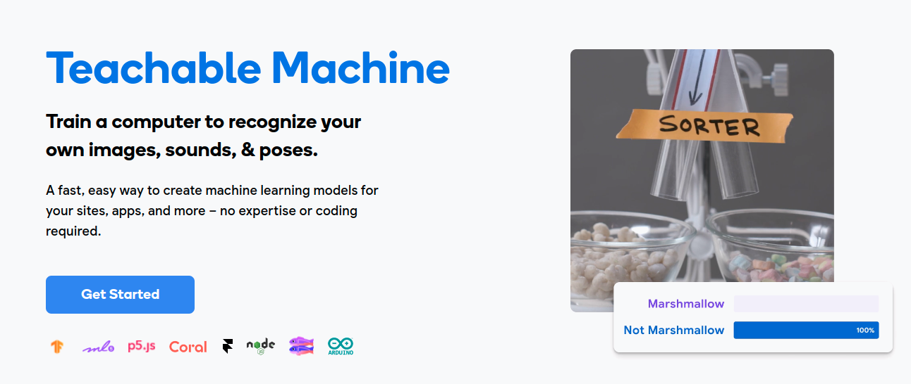

# Teachable Machine

* Demo and get familiar with the Teachable Machine

### Step 1. Let's start

* Open the [Teachable Machine Link](https://teachablemachine.withgoogle.com/)
* Observe the demos on the main page. See the purpose of each of the four classifiers.

### Step 2. Watch the movie

* Watch and explain the movie
* What is your opinion of the practical usefulness of this machine?
* Discuss.

### Step 3. Train the machine to tell you from your book

* Demo it for the students.
* Let the students train their model and demonstrate it to the class.
